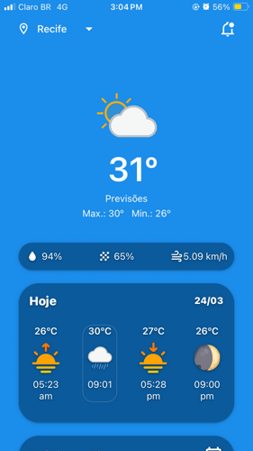
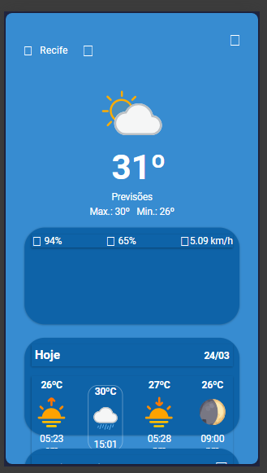

# weather-react-native

Esse projeto expo react-native consome a API do hgbrasil.

## Como rodar

1. Clone ou faça download do repositório

2. Instale as dependências na pasta principal com

```
npm install
```

3. Instale as dependências do backend com

```
cd backend
npm install
```

4. Inicie o backend express com


```
node server.js
```

5. Abra outro terminal e volte para a pasta principal do projeto

6. Rode o projeto expo com

```
npx expo start
```

Opcional: você pode ativar a requisição de API no projeto entrando na screen WeatherForecast.js e descomentando a linha 42, e comentando o mock da linha 45-100

## Imagens




